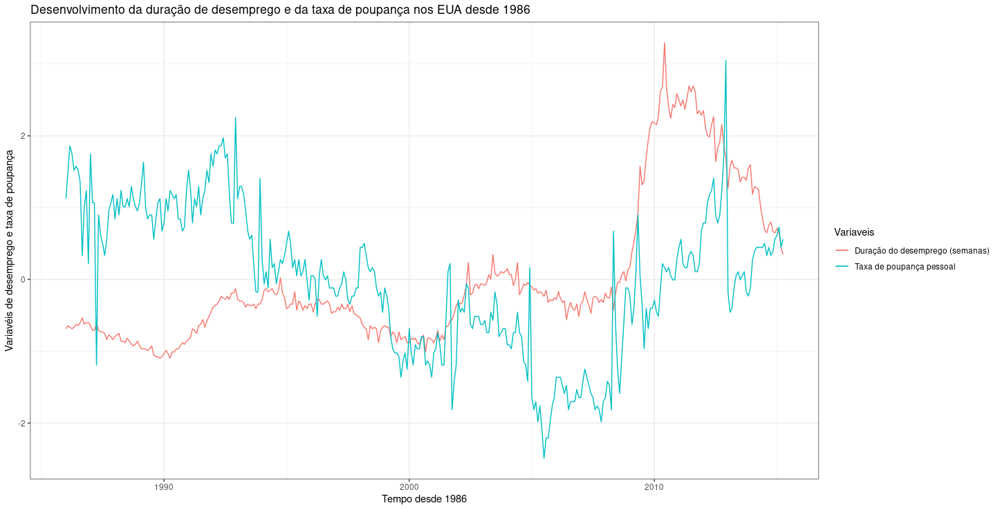

# Exercicio 1 - Projeto PE 2022/2023

O objetivo deste exercício é representar, através de um gráfico de linhas, a evolução da duração mediana do desemprego em semanas(`ddsemp`) e da taxa de poupança pessoal (`tpp`) nos Estados Unidos desde 1986 até 2015. Para tal, recorreu-se ao seguinte trecho de código `R` (utilizando as bibliotecas ```openxlsx``` e ```ggplot2```):

```r
df <- read.xlsx("assets/econ.xlsx", sheet = 1, rows = c(1,seq(224,575)), cols = c(1,4,5), colNames = TRUE, rowNames = FALSE)
df$tempo <- as.Date(df$tempo, origin = "1899-12-30") 
df$tpp <- (df$tpp - mean(df$tpp)) /sd(df$tpp)
df$ddesemp <- (df$ddesemp - mean(df$ddesemp)) /sd(df$ddesemp)
ggplot(df, aes(x = tempo, color = Variaveis)) +
  geom_line(aes(y = ddesemp, color = "Duração do desemprego (semanas)"))+
  geom_line(aes(y = tpp, color = "Taxa de poupança pessoal"))+
  labs(x = "Tempo desde 1986", y = "Variavéis de desemprego e taxa de poupança")+
  ggtitle("Desenvolvimento da duração de desemprego e da taxa de poupança nos EUA desde 1986")+
  theme_bw()
``` 

Observando o gráfico produzido pela chamada a `ggplot`, podemos notar que a duração mediana do desemprego em semanas (`ddsemp`) tem estagnado até ao final da década de 2000 onde aumentou drasticamente e tem descido num bom ritmo desde esse aumento drástico. A taxa de poupança pessoal (`tpp`) estave numa descrescente até ao final da década de 2000, conseguindo ver um aumento bastante significativo e que após esse aumento tem estagnado.


