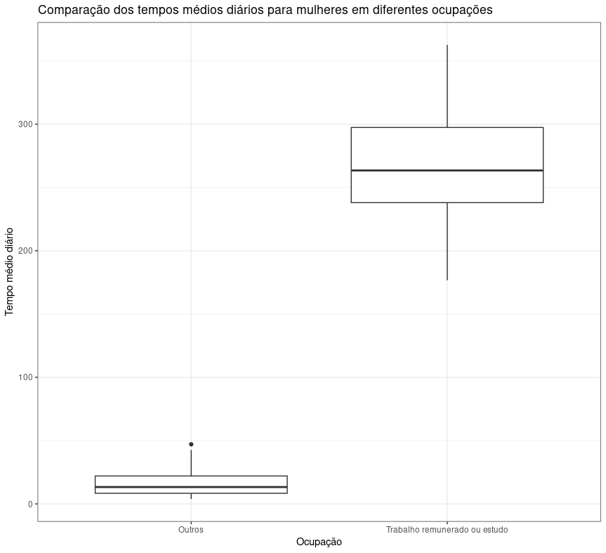

# Exercicio 2 - Projeto PE 2022/2023

O objetivo deste exercício é comparar, através de dois diagramas de extremos e quartis, os tempos médios diários registados para `Todos` em duas ocupações distintas: `Outros` e `Trabalho remunerado ou estudo`. Para tal, recorreu-se ao seguinte trecho de código `R` (utilizando a biblioteca ```ggplot2```):

```r
df <- read.csv("Desktop/PE/projeto PE/assets/TIME_USE_24092022.csv")
df <- df[df$País != "África do Sul", ]
df_total <- df[df$Sexo == "Total" & (df$Ocupação == "Outros" | df$Ocupação == "Trabalho remunerado ou estudo"), ]
ggplot(df_total, aes(x = Ocupação, y = Tempo)) +
  geom_boxplot() +
  labs(title = "Comparação dos tempos médios diários para mulheres em diferentes ocupações",
  y = "Tempo médio diário (minutos)") +
  theme_bw()
```
Após este excerto de código, é devolvido este gráfico:

