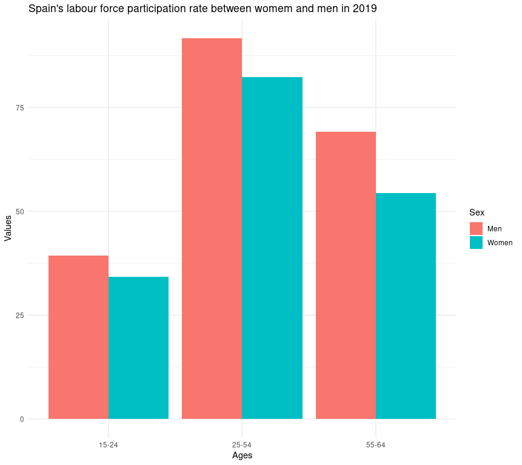

# Exercicio 3 - Projeto PE 2022/2023

O objetivo deste exercício é observar, através de um gráfico de barras,a taxa de participação na força de trabalho `espanhola` em `2019`. Para tal, recorreu-se ao seguinte trecho de código `R` (utilizando a biblioteca ```ggplot2```):

```r
df <- read.delim("Desktop/PE/projeto PE/assets/GENDER_EMP_19032023152556091.txt")
df <- df[df$SEX != "ALL_PERSONS", ]
df <- df[df$IND == "EMP1", ]
df <- df[df$Country == "Spain", ]
df <- df[df$AGE != "1564" & df$AGE != "TOTAL", ]
df <- df[df$TIME == "2019", ]
ggplot(df, aes(x = Age.Group, y = Value, fill = Sex)) +
  geom_bar(stat = "identity", position = position_dodge()) +
  theme_minimal() +
  labs(x = "Ages", y = "Values") +
  ggtitle("Spain's labour force participation rate between womem and men in 2019")
```

Conseguimos então perceber pelo gŕafico dado por `ggplot` que entre os 15 a 24 anos, a taxa de participação é consideravelmente menor do que as restantes faixas etárias chegando por volta dos 35%. Entre os 25 a 54 anos é onde se vê a maior taxa de participação, ultapassando os 80% e entre os 55 a 64 anos, a taxa começa a decrescer. Também conseguimos perceber que em todas as faixas etárias, as mulheres têm um valor menor de taxa do que os homens.

