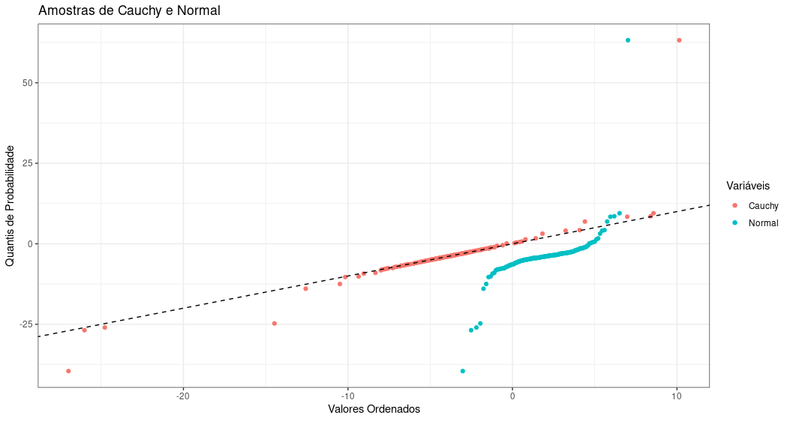

# Exercicio 8 - Projeto PE 2022/2023

O objetivo deste exercício é observar, através de dois gráficos de linhas, os valores gerados ordenados versus os quantis de probabilidade das distribuições de Cauchy e normal. Para tal, recorreu-se ao seguinte trecho de código `R` (utilizando a biblioteca ```ggplot2```):

```r
set.seed(1962)
n <- 165

amostra_cauchy <- rcauchy(n, location = -3.8, scale = 1.6)
amostra_ordenada_cauchy <- sort(amostra_cauchy)

amostra_normal <- rnorm(n, mean = 2, sd = 2)
amostra_ordenada_normal <- sort(amostra_normal)

quantis <- (1:n)/(n + 1)

dados_cauchy <- data.frame(Quantil = quantis, Valor = amostra_ordenada_cauchy)
dados_normal <- data.frame(Quantil = quantis, Valor = amostra_ordenada_normal)

> ggplot() +
    geom_point(data = dados_cauchy, aes(x = Quantil, y = Valor, color = "Cauchy")) +
    geom_point(data = dados_normal, aes(x = Quantil, y = Valor, color = "Normal")) +
    geom_abline(intercept = 0, slope = 1, linetype = "dashed") +
    labs(x = "Quantis de Probabilidade", y = "Valores Ordenados", 
          title = "Amostras de Cauchy e Normal") +
    theme_minimal() +
    guides(color = guide_legend(title = "Variáveis"))
```
Com isto, obtemos este gráfico (a bissetriz é a linha preta tracejada): 


